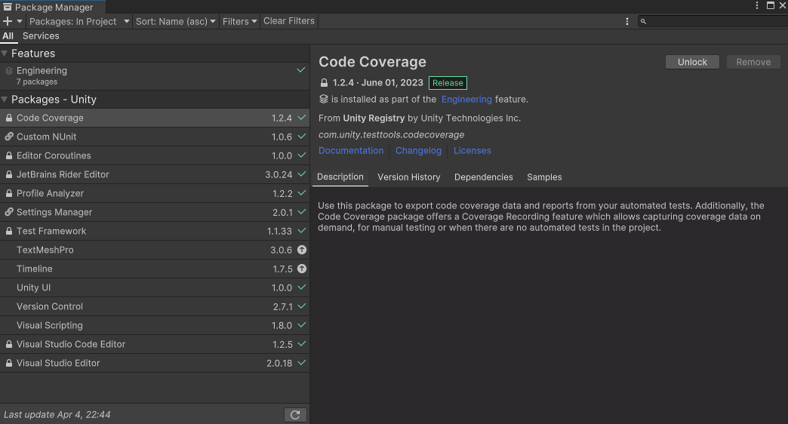
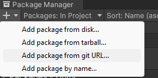
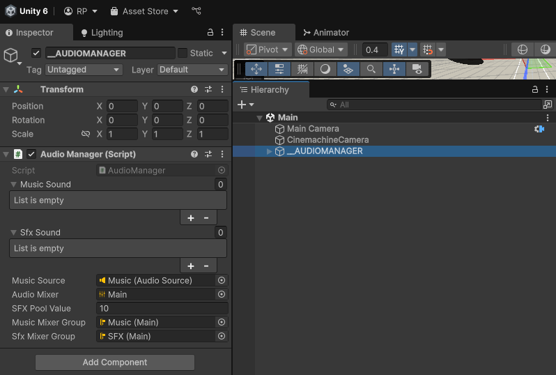
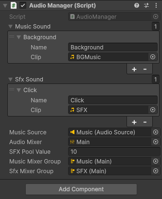

# Unity Package

Rumyoonomicon's Simple Audio Manager

## Description

A simple audio manager for Unity that allows you to play, pause, and stop audio clips easily. It supports pooling of audio sources for better performance and memory management.

## Getting Started
---
### Installing

#### Step 1
<p align="center">
    
</p>

Open Unity Package Manager **(Window > Package Manager)**

#### Step 2
<p align="center">
    
</p>

Click the plus icon in the top left corner and select **Add package from git URL...**

#### Step 3

paset the following URL in the input field and click **Add**

```
https://github.com/perezromeojohn/unity-audiomanager.git
```

And you are done! yay!

---

### How to use

* Look for the MenuItem in the Toolbar **Tools > Rumyoonomicon > Audio Manager**
* Click on it to create a gameobject with the AudioManager component attached to it.

<p align="center">
    
</p>

* You can see in the inspector the AudioManager component with the following properties:
    * **Background Sound** : A list of audio clips that will be played as background music.
    * **Effects Sound** : A list of audio clips that will be played as sound effects.
    * **Music Source** : The audio source that will be used to play the background music.
    * **Audio Mixer** : The audio mixer that will be used to control the volume of the background music and sound effects. Comes with a predefined mixer group for background music and sound effects.
    * **Audio Source Pool** : The pool of audio sources that will be used to play the sound effects. You can set the size of the pool and the audio source prefab that will be used.
    * **Music Mixer Group** : The audio mixer group that will be used to play the background music.
    * **Sfx Mixer Group** : The audio mixer group that will be used to play the sound effects.

* Now to add sounds to it simply click to add an element and drag the audio clips to the **Background Sound** or **Effects Sound** list as well as giving them a name to identify them.

<p align="center">
    
</p>

* To play a sound simply call the **PlaySound** method from the AudioManager component and pass the name of the sound you want to play as a string.

```csharp
// Play the sound effect with the name "Click"
AudioManager.Instance.PlaySFX("Click"); 

// Play the background music with the name "BackgroundMusic"
AudioManager.Instance.PlayMusic("Background");
```

* You can set the pool size of the audio sources in the inspector. The default value is 10. This means that 10 audio sources will be created and used to play the sound effects. If you want to change the pool size, simply change the value in the inspector.

* From here on you can modify the AudioManager script to your liking. You can add more features or modify the existing ones. The script is well documented and easy to understand.

* Cause this is only for my prototyping needs I will not be adding more features to it. But feel free to fork it and add your own features.

## Author
* [@rumyoonomicon](https://twitter.com/rumyoonomicon)

## Version History

* [1.0.0](CHANGELOG.md)
    * Initial release of the AudioManager package.
* [1.0.1](CHANGELOG.md)
    * Added documentation for ReadMe and Changelog.
    * Fixed minor bugs in the AudioManager script.

## Acknowledgments

To my cheeky girlfriend Gabrielle for always supporting me and pushing me to do better. 💕